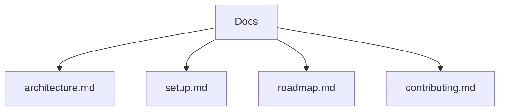

## 프로젝터 Docs

### 개요
프로젝터(프로젝트 문서) 저장소입니다. 아키텍처, 환경설정, 로드맵, 기여 가이드를 한 곳에서 확인할 수 있습니다.

### 목차
- [아키텍처](./architecture.md)
- [환경 설정 및 실행](./setup.md)
- [로드맵](./roadmap.md)
- [기여 가이드](./contributing.md)

### 문서 구조 다이어그램

### 디자인 레퍼런스
- Joey Portfolio Figma: [디자인 링크](https://www.figma.com/design/Ar4Raoh5BGzs57t5xHbeFS/Joey---Portfolio-Website--Community-?node-id=1-4&m=dev)