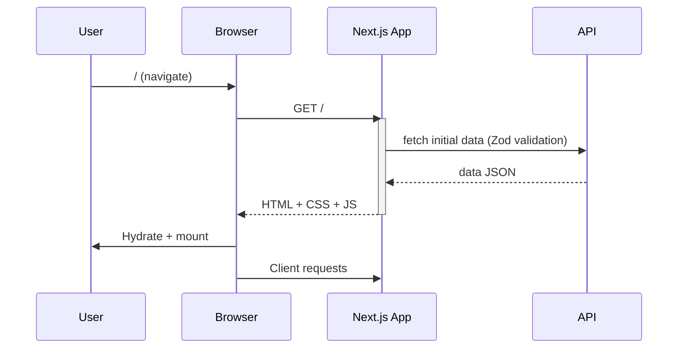
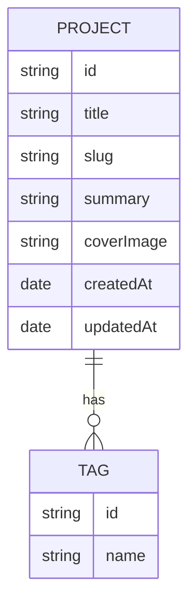

## 아키텍처

### 개요
- **프레임워크**: Next.js (App Router)
- **스타일**: Tailwind CSS v4, 다크/라이트 테마(next-themes)
- **UI**: Radix Primitives, Lucide 아이콘
- **데이터 검증**: Zod
- **애니메이션**: Motion(Framer Motion)

### 시스템 개요 다이어그램
```mermaid
flowchart LR
  user((사용자)) -->|HTTPS| web[Next.js App<br/>(App Router)]
  web -->|SSR/ISR/SSG| edge[Edge Runtime/CDN]
  web --> api[BFF / API Routes]
  api --> ext[외부 API/서비스]
  api --> db[(Database)]
  web --> assets[(Static Assets / Images)]
  subgraph Observability
    logs[Logs / Tracing]
    metrics[Metrics]
  end
  web -.-> logs
  api -.-> logs
  api -.-> metrics
```

### 페이지 렌더링 시퀀스


### 데이터 모델(ER) 예시


### 테마/디자인 토큰
- **토큰 우선**: 색상/간격/타이포는 디자인 토큰으로 관리
- **다크/라이트**: `next-themes`로 `data-theme` 또는 `class` 기반 전환
- **접근성**: 최소 대비 4.5:1, 포커스 스타일 유지

### 폴더 구조 제안
- `app/` App Router 라우트
- `app/(marketing)/`, `app/(content)/` 섹션 분리
- `components/ui/*` 재사용 컴포넌트
- `lib/*` 유틸/헬퍼
- `styles/*` Tailwind 레이어