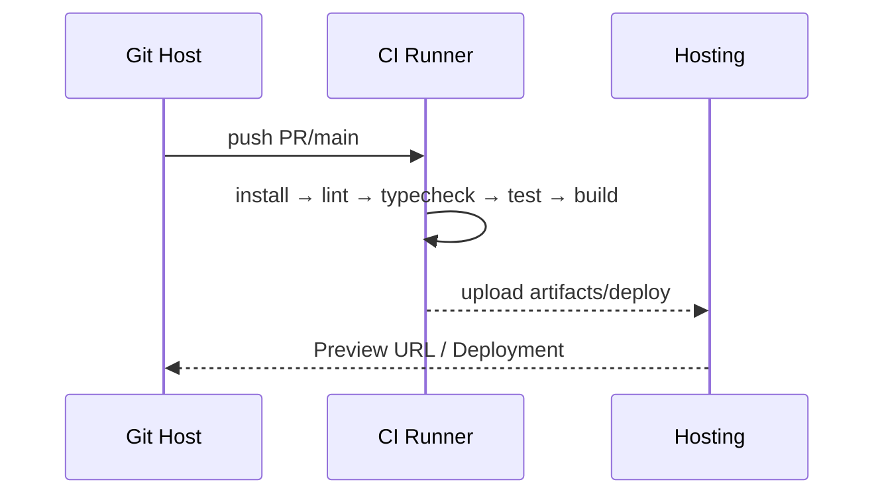

## 환경 설정 및 실행

### 요구사항
- Node.js 18+
- pnpm 9+ (또는 npm/yarn)
- Git

### 설치
```bash
pnpm install
```

### 개발 서버
```bash
pnpm dev
```

### 환경 변수
```bash
# .env.local 예시
NEXT_PUBLIC_SITE_URL="http://localhost:3000"
NEXT_PUBLIC_ANALYTICS_ID=""
DATABASE_URL=""
```

### 로컬 개발 흐름


### 빌드 & 프리뷰
```bash
pnpm build
pnpm start
```

### CI 파이프라인(예시)


### 권장 VSCode 확장
- ESLint, Prettier, Tailwind CSS IntelliSense